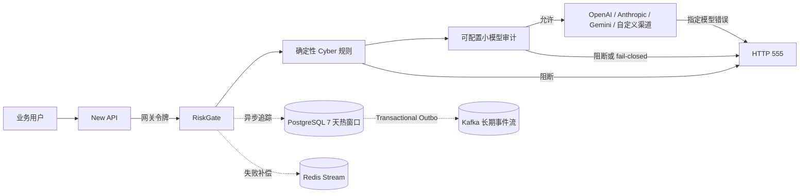

# RiskGate：New API 渠道风控与请求追踪平台

RiskGate 部署在 **New API 与模型渠道之间**，为每一次模型请求提供同步风控、统一错误码、渠道密钥隔离、分布式限流和异步请求追踪。

> 当前代码位于独立目录 `newapi-risk-control/`，不会修改仓库原有 Android 工程。

## 1. 总体架构



同步请求路径只做规则匹配、小模型判定、限流和上游转发。追踪写入通过内存批队列异步执行，PostgreSQL 与 Kafka 之间使用 Transactional Outbox，数据库不可用时可进入 Redis Stream 补偿队列。

## 2. 功能范围

- OpenAI-compatible、Anthropic、Gemini 和自定义 HTTP 上游路由。
- 每条路由独立网关令牌；真实渠道 API Key 使用 AES-256-GCM 加密保存。
- 内置 Cyber 风险规则优先判定，自定义规则支持 Go RE2 正则、优先级和动作配置。
- 可配置 OpenAI-compatible 小模型审计器，支持 `closed`、`open`、`shadow` 三种失败策略。
- 风控命中、审计 fail-closed、限流、并发保护和指定渠道模型错误统一返回 HTTP `555`。
- SSE 首事件审查、单帧大小限制及流内错误归一。
- PostgreSQL 按日分区，默认只保留 7 天；页面可修改窗口。
- Redis 分布式令牌桶、并发信号量、审计缓存、防重放 nonce 和追踪故障补偿。
- Kafka TLS、SASL/PLAIN、SCRAM-SHA-256、SCRAM-SHA-512、可配置 topic retention。
- New API 主动上报追踪数据的 HMAC API。
- JWT RBAC 管理面：`admin`、`operator`、`auditor`、`viewer`。
- 可视化页面：运行概览、路由、审计模型、Cyber 规则、追踪、存储策略、审计试跑。
- Prometheus 文本指标、健康检查、就绪检查和管理员操作审计。

## 3. 快速启动

### 3.1 生成配置

```bash
cd newapi-risk-control
cp .env.example .env

openssl rand -base64 48   # ADMIN_JWT_SECRET
openssl rand -base64 48   # TRACE_HMAC_SECRET
openssl rand -base64 48   # PROMPT_HASH_SECRET
openssl rand -base64 32   # MASTER_ENCRYPTION_KEY，必须解码为 32 字节
openssl rand -base64 36   # BOOTSTRAP_ADMIN_PASSWORD
```

把生成值分别写入 `.env`。生产环境必须设置：

```dotenv
APP_ENV=production
PUBLIC_BASE_URL=https://risk.example.com
REDIS_REQUIRED=true
FAIL_CLOSED=true
ALLOW_PRIVATE_UPSTREAMS=false
TRUST_PROXY_HEADERS=true
```

`TRUST_PROXY_HEADERS=true` 只能在 RiskGate 前面是可信反向代理或负载均衡器时开启，并在边界层覆盖客户端自行提交的 `X-Forwarded-For`。

### 3.2 启动 PostgreSQL、Redis 和 RiskGate

```bash
docker compose up -d --build
curl http://127.0.0.1:8080/readyz
```

管理页面：

```text
http://127.0.0.1:8080/admin/
```

首次管理员由以下环境变量创建：

```dotenv
BOOTSTRAP_ADMIN_USERNAME=admin
BOOTSTRAP_ADMIN_PASSWORD=<强随机密码>
BOOTSTRAP_ADMIN_ROLE=admin
```

同名管理员已存在时不会被启动过程覆盖。

### 3.3 可选 Kafka

在 `.env` 中设置：

```dotenv
KAFKA_BROKERS=kafka:9092
KAFKA_TOPIC=riskgate.audit.events.v1
KAFKA_RETENTION_HOURS=720
```

启动本地单节点 Kafka：

```bash
docker compose --profile kafka up -d --build
```

本地 Compose 的 Kafka 使用明文网络，只用于开发。生产环境应使用至少 3 个 broker、TLS、SASL/SCRAM、足够的复制因子和 `min.insync.replicas`。

## 4. New API 渠道对接

### 4.1 在 RiskGate 创建审计模型

在“审计模型”页面配置一个 OpenAI-compatible 小模型：

```text
Endpoint: http(s)://audit-model.example/v1
Model: qwen-small-audit
Fail mode: closed
Block threshold: 0.72
Timeout: 8000 ms
```

也可以通过启动环境变量自动创建 `default-small-model`：

```dotenv
AUDIT_MODEL_ENDPOINT=https://audit-model.example/v1
AUDIT_MODEL_NAME=qwen-small-audit
AUDIT_MODEL_API_KEY=...
AUDIT_MODEL_FAIL_MODE=closed
AUDIT_MODEL_BLOCK_THRESHOLD=0.72
```

### 4.2 创建渠道路由

在“渠道路由”页面填写：

```text
Slug: openai-main
Upstream kind: openai
Upstream Base URL: https://api.openai.com
真实上游 API Key: sk-...
审计模型: default-small-model
```

保存后页面只显示一次随机生成的 **网关令牌**。真实渠道 Key 不会返回给浏览器或 New API。

### 4.3 配置 New API 渠道

在 New API 渠道中设置：

```text
Base URL: https://risk.example.com/gateway/openai-main
API Key: <RiskGate 一次性网关令牌>
```

渠道类型仍选择真实上游的协议类型。New API 发出的原始路径会拼接到路由的上游 Base URL：

```text
/gateway/openai-main/v1/chat/completions
            ↓
https://api.openai.com/v1/chat/completions
```

RiskGate 会先验证网关令牌，再移除 New API 发送的认证头，最后注入加密保存的真实渠道密钥。

### 4.4 可选追踪头

New API 可在请求中附带：

```http
X-Request-ID: req_01J...
X-NewAPI-Parent-Request-ID: parent_01J...
X-NewAPI-Tenant-ID: tenant-a
X-NewAPI-User-ID: user-123
```

用户 ID、客户端 IP、User-Agent 和网关令牌只保存密钥化 HMAC，不保存明文。

## 5. HTTP 555 契约

### 5.1 返回 555 的情况

- 命中 `block` Cyber 规则。
- 小模型判定达到阻断阈值。
- 审计模型超时、不可用或格式错误，且配置为 `closed`。
- 路由停用、网关鉴权失败、分布式限流或最大并发触发。
- 上游网络不可用。
- 上游返回配置要求归一的状态码、错误码或错误消息模式。
- SSE 首个事件就是模型错误，或首帧超过大小限制。

### 5.2 响应格式

```http
HTTP/1.1 555
Content-Type: application/json
X-Risk-Error-Code: 555
X-Risk-Error-Class: RISK_POLICY_BLOCKED
X-Risk-Request-ID: req_01J...
```

```json
{
  "error": {
    "message": "Request rejected by the risk-control gateway.",
    "type": "risk_control_error",
    "param": null,
    "code": 555
  },
  "request_id": "req_01J..."
}
```

对外消息故意不暴露具体命中的规则、渠道报错详情或审计器内部异常。完整分类只出现在受权限保护的追踪页面。

### 5.3 上游错误策略

路由高级设置支持：

```json
{
  "normalize_statuses": [401, 403, 404, 408, 409, 429, 500, 502, 503, 504],
  "normalize_codes": [
    "model_not_found",
    "insufficient_quota",
    "rate_limit_exceeded",
    "overloaded_error"
  ],
  "message_patterns": [
    "(?i)model.{0,24}(not found|unavailable|overloaded)"
  ],
  "pass_statuses": []
}
```

`pass_statuses` 是显式最高优先级白名单。普通未命中的 `400`、`422` 会自然透传；若响应正文明确包含 `model_not_found` 等模型错误，则会归一为 `555`。

### 5.4 SSE 限制

HTTP 响应头一旦以 `200` 发出，协议上无法再改成 `555`。因此：

- 首个完整 SSE 事件为错误：直接返回 HTTP `555`。
- 已发送正常事件后上游再报错：保持 HTTP `200`，发送标准化的 `event: error`，其中 `code=555`，随后关闭流。

客户端应同时处理 HTTP `555` 和 SSE 流内 `555` 错误事件。

## 6. New API 主动追踪上报

接口：

```text
POST /api/v1/traces/ingest
```

请求头：

```http
X-Risk-Timestamp: <Unix 秒>
X-Risk-Nonce: <每次请求唯一随机值>
X-Risk-Key-ID: newapi
X-Risk-Signature: <hex HMAC-SHA256>
```

签名原文：

```text
timestamp + "\n" + nonce + "\n" + hex(sha256(raw_body))
```

签名密钥为 `TRACE_HMAC_SECRET`，允许时间偏差 5 分钟；nonce 在 Redis 或单实例内存中保存 10 分钟，重复请求会返回 `409`。

单条事件：

```json
{
  "external_request_id": "req-123",
  "parent_request_id": "session-456",
  "route_slug": "openai-main",
  "tenant_id": "tenant-a",
  "user_id": "user-123",
  "api_key_fingerprint": "newapi-key-id-9",
  "model": "gpt-example",
  "provider": "openai",
  "method": "POST",
  "path": "/v1/chat/completions",
  "http_status": 200,
  "outcome": "newapi_completed",
  "metadata": {
    "billing_units": 1234,
    "region": "us-east"
  },
  "occurred_at": "2026-09-01T10:20:30Z"
}
```

批量格式：

```json
{
  "events": [
    {"external_request_id": "req-1", "outcome": "accepted"},
    {"external_request_id": "req-2", "outcome": "completed"}
  ]
}
```

每批最多 1000 条、请求体最多 2 MiB。`metadata` 中包含 `prompt`、`messages`、`content`、`token`、`cookie`、`authorization`、`password`、`secret` 等字段会被递归剔除。

签名示例见 [`examples/trace_ingest.py`](examples/trace_ingest.py)。

## 7. 数据生命周期

### PostgreSQL

- `request_traces` 按 UTC 日期分区。
- 默认窗口 7 天。
- 每小时预创建未来分区并删除过期分区。
- 当前管理查询只针对 PostgreSQL 热数据。
- `request_traces_default` 非零时应告警，表示有事件未进入预期日期分区。

### Redis

Redis 不是主查询数据库，承担：

- 分布式限流与最大并发。
- 审计结果短缓存。
- HMAC nonce 防重放。
- PostgreSQL/Kafka 故障时的追踪 Stream 补偿。

生产环境建议 Redis Cluster 或 Sentinel，并设置持久化、内存告警和 `noeviction`。

### Kafka

Kafka 保存长期事件流，页面配置 `kafka_retention_hours`。追踪先与 Outbox 同事务写入 PostgreSQL，再由后台 worker 投递，避免“数据库成功、Kafka 丢失”的双写窗口。

需要长期可检索分析时，应再部署 Kafka Connect/Flink 消费者写入 ClickHouse、OpenSearch、对象存储或数据仓库；Kafka retention 本身不等同于无限期分析数据库。

## 8. 安全设计

- 渠道 Key 与审计模型 Key 使用 AES-256-GCM 加密。
- 管理员密码使用 bcrypt cost 12。
- 管理 API 使用带 issuer、audience 和过期时间校验的 HS256 JWT。
- 生产启动拒绝示例密钥、弱密钥、示例主加密密钥和进程级 fail-open。
- 默认禁止私网、loopback、link-local、multicast 和保留地址上游。
- 公网上游在实际拨号时重新解析并校验 IP，且禁用环境 HTTP 代理，降低 DNS rebinding 和代理绕过风险。
- 禁止自动跟随上游重定向。
- 请求体、响应体和 SSE 单帧均有限制。
- 原始 prompt 在数据库约束和 API 层均被禁止落库。
- 管理变更写入 `admin_audit_logs`，敏感密钥字段不会序列化到审计记录。

只有确实需要访问内网模型服务时，才同时开启：

```dotenv
ALLOW_PRIVATE_UPSTREAMS=true
```

并在单条路由上勾选“允许私网端点”。生产环境还应使用 NetworkPolicy、出口代理或服务网格，把可访问目标限制到明确的模型服务网段。

## 9. 高并发与商业化部署

仓库提供 [`deploy/kubernetes.yaml`](deploy/kubernetes.yaml) 作为无状态 RiskGate 部署基线。正式上线建议：

- RiskGate 至少 3 个副本，跨可用区部署；配置 HPA 与 PDB。
- 托管 PostgreSQL 高可用集群，按请求量调优连接池；大规模部署增加 PgBouncer。
- Redis Cluster/Sentinel，`REDIS_REQUIRED=true`，避免多副本降级到各自本地限流。
- Kafka 3 个或更多 broker，复制因子至少 3，启用 TLS 和 SCRAM。
- TLS 在可信负载均衡器或 Ingress 终止，关闭公网直连容器端口。
- 为 `/admin/`、`/metrics`、`/readyz` 使用独立内网入口或访问控制。
- 告警指标：555 比例、审计延迟、上游延迟、Redis 故障、Outbox pending/dead、default partition rows、HTTP 5xx。
- 对渠道设置合理 RPS、burst、最大并发和超时，避免单个渠道拖垮共享资源。
- 进行容量压测、故障注入、备份恢复、主密钥轮换和灾难恢复演练。

负载测试脚本见 [`tests/load/k6_gateway.js`](tests/load/k6_gateway.js)。脚本默认使用无害请求，不应对真实付费渠道直接运行。

## 10. 运维接口

```text
GET /healthz   进程存活
GET /readyz    PostgreSQL 与必需 Redis 就绪
GET /metrics   Prometheus 文本指标
GET /admin/    管理页面
```

当前指标：

```text
riskgate_routes_enabled
riskgate_rules_enabled
riskgate_traces_last_hour
riskgate_blocks_last_hour
riskgate_outbox_pending
riskgate_outbox_dead
riskgate_default_partition_rows
```

完整 HTTP 定义见 [`docs/openapi.yaml`](docs/openapi.yaml)。

## 11. 本地质量检查

```bash
make fmt
make test
make vet
make build
```

或：

```bash
go mod tidy
go test -race ./...
go vet ./...
go build ./cmd/riskgate
```

CI 还会构建容器镜像并校验 Compose 配置。

## 12. 当前明确边界

- HTTP `555` 是业务自定义状态码，必须在正式上线前验证 CDN、WAF、Ingress、负载均衡器和 New API 对非标准状态码的透传行为。
- 已提交 `200` 的 SSE 无法改写 HTTP 状态，只能发送流内 `555` 事件。
- 管理追踪页面查询 PostgreSQL 热窗口；Kafka 长期数据需外接分析存储。
- 内置规则是高置信、低误伤的基线，不替代持续规则运营、模型评估和人工复核流程。
- 审计小模型的准确率、延迟和容灾能力需要使用企业自己的真实分布数据离线评估后再设定阈值。
